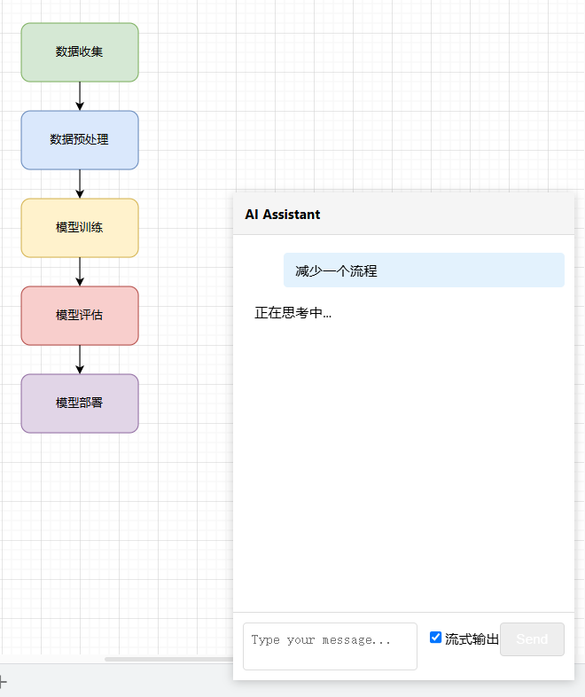
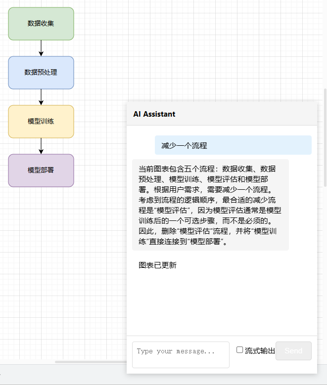

# 科研绘图助手 FlowGen


> 目标：本项目将实现一个自动帮助科研er绘图的agent，通过对话的形式生成各类实验数据的绘图文件，可编辑的流程图。

> 顺便存储基于Datawhale的课程wow agent所作的笔记。

> 原课程链接：[@Datawhale课程](https://www.datawhale.cn/learn/summary/86)

> 始于 2025-01-13


## 效果






## 目录

- [Datawhale课程笔记](./learning)
- [绘图助手后端](./backend)
- [绘图助手前端](./drawio-22.0.0)

## 更新日志

- 2025-02-11 添加了绘图助手聊天窗口，可以通过对话即时生成`可编辑的绘图文件`。

## TODO

- 前端优化绘图文件的保存
- 前端绘图助手聊天窗口优化
    - 可拖拽
    - 可调整大小
    - 可隐藏/显示
    - 可调整模型参数
- 后端绘图助手服务优化
    - 应用Git diff算法，优化绘图文件的修改


### 通信协议规范：

```
// 请求格式
{
    message: "用户输入内容",
    fileContent: "<mxfile>...</mxfile>" // 当前文件XML内容
}

// 响应格式
{
    analysis: "文本分析结果", 
    fileContent: "<mxfile>...</mxfile>" // 修改后的文件内容
}
```


### 核心交互流程：

用户输入消息 → 获取当前文件内容 → 发送模拟请求
接收响应 → 更新聊天记录 → 应用文件修改


背景资料参考：
1. plantUML入门：
https://zhuanlan.zhihu.com/p/1158714578
2. https://uqoo.cc/plantuml-jian-jie-ji-webduan-xuan-ran-fang-fa/
