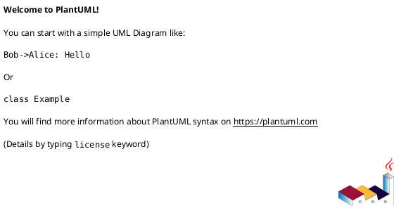
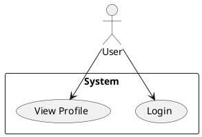
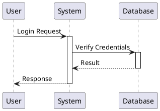
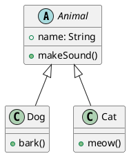
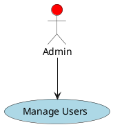

# PlantUML 使用指南

## 1. 基础语法

### 1.1 基本结构
PlantUML 图表以 `@startuml` 开始，以 `@enduml` 结束：

### 1.2 注释
- 单行注释：使用单引号 `'` 或 `//`
- 多行注释：使用 `/'` 和 `'/`

## 2. 用例图

### 2.1 基本元素
- 角色（Actor）：使用 `actor` 关键字
- 用例（Use Case）：使用 `usecase` 关键字
- 系统边界：使用 `rectangle` 关键字

示例：

### 2.2 关系
- 关联：`-->`
- 包含：`<..`
- 扩展：`<|--`
- 依赖：`..>`

## 3. 时序图

### 3.1 基本元素
- 参与者：`participant`
- 激活：`activate`
- 停用：`deactivate`
- 消息：`->`

示例：

## 4. 类图

### 4.1 基本元素
- 类：`class`
- 接口：`interface`
- 抽象类：`abstract class`

### 4.2 关系
- 继承：`<|--`
- 实现：`..|>`
- 组合：`*--`
- 聚合：`o--`

示例：

## 5. 样式设置

### 5.1 颜色
- 背景色：`#背景色`
- 文字颜色：`<color:颜色>`

### 5.2 字体
- 字体大小：`<size:大小>`
- 字体样式：`<style:样式>`

示例：

## 6. 布局

### 6.1 方向设置
- 左到右：`left to right direction`
- 上到下：`top to bottom direction`

### 6.2 对齐
- 居中：`center`
- 左对齐：`left`
- 右对齐：`right`

## 7. 最佳实践

### 7.1 命名规范
- 使用有意义的标识符
- 保持一致的命名风格
- 避免特殊字符

### 7.2 布局建议
- 保持图表简洁
- 适当使用注释
- 合理分组相关元素 