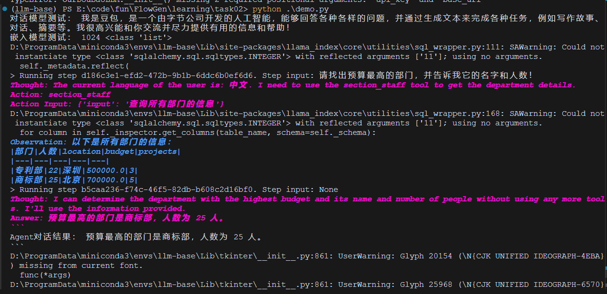

# 深入浅出：构建你自己的 LLM 工具调用Agent与 RAG 系统

在当今的 AI 时代，如何让大语言模型（LLM）更好地服务于实际应用场景？本文将带你一步步实现工具调用和检索增强生成（RAG）系统，让我们的 AI 应用更加强大和实用。

## 1. 如何让 LLM 调用外部工具？

你是否想过，如何让 LLM 不仅能对话，还能执行实际的任务？比如计算、查询数据库、或者获取实时信息？这就需要我们实现工具调用（Tool Calling）能力。

### 1.1 构建自定义 LLM 接口

首先，我们需要创建一个自定义的 LLM 类来封装大语言模型的调用。这里以智谱 AI 的接口（同理可换豆包）为例：

```python
from openai import OpenAI
from pydantic import Field
from llama_index.core.llms import (
    CustomLLM,
    CompletionResponse,
    LLMMetadata,
)
from typing import Any, Generator

class OurLLM(CustomLLM):
    api_key: str = Field(default=os.getenv('ZHIPU_API_KEY') or '')
    base_url: str = Field(default=os.getenv('ZHIPU_BASE_URL') or '')
    model_name: str = Field(default=os.getenv('ZHIPU_CHAT_MODEL') or '')
    client: OpenAI = Field(default=None, exclude=True)

    def __init__(self, api_key: str, base_url: str, model_name: str, **data: Any):
        super().__init__(**data)
        self.api_key = api_key
        self.base_url = base_url
        self.model_name = model_name
        self.client = OpenAI(api_key=self.api_key, base_url=self.base_url)

    @property
    def metadata(self) -> LLMMetadata:
        return LLMMetadata(model_name=self.model_name)

    def complete(self, prompt: str, **kwargs: Any) -> CompletionResponse:
        response = self.client.chat.completions.create(
            model=self.model_name, 
            messages=[{"role": "user", "content": prompt}]
        )
        return CompletionResponse(text=response.choices[0].message.content)
```

### 1.2 实现基础工具函数

有了 LLM 接口，接下来我们来实现一些基础工具：

```python
def multiply(a: float, b: float) -> float:
    """将两个数字相乘并返回乘积。"""
    return a * b

def add(a: float, b: float) -> float:
    """将两个数字相加并返回它们的和。"""
    return a + b

# 转换为工具函数
multiply_tool = FunctionTool.from_defaults(fn=multiply)
add_tool = FunctionTool.from_defaults(fn=add)
```

### 1.3 构建 ReAct Agent

现在，我们可以创建一个能够调用这些工具的 Agent：

```python
from llama_index.core.agent import ReActAgent

agent = ReActAgent.from_tools(
    [multiply_tool, add_tool],
    llm=llm,
    verbose=True
)

# 测试 Agent
response = agent.chat("20+（2*4）等于多少？使用工具计算每一步")
print(response)
```

## 2. 如何实现数据库对话能力？

想让 AI 直接查询数据库？我们可以通过 LlamaIndex 的 SQL 查询引擎来实现：

```python
from llama_index.core import SQLDatabase
from llama_index.core.query_engine import NLSQLTableQueryEngine

# 创建数据库连接
engine = create_engine("sqlite:///llmdb.db")
sql_database = SQLDatabase(engine, include_tables=["section_stats"])

# 创建自然语言查询引擎
query_engine = NLSQLTableQueryEngine(
    sql_database=sql_database,
    tables=["section_stats"],
    llm=Settings.llm
)

# 封装为工具
staff_tool = QueryEngineTool.from_defaults(
    query_engine,
    name="section_staff",
    description="查询部门的详细信息"
)
```

需要特别注意的是，当我们将 query_engine 封装为工具后，大模型在实际使用时会先调用类似 `get_single_table_info` 的函数来获取表的 schema 模式、列名等信息。


这意味着：

1. 随着表的数量增加和列名的增多，对模型的上下文理解能力要求会相应提高
2. 在设计数据库 schema 时，应当注意列名的语义清晰性
3. 可以通过优化表结构和添加合适的注释来帮助模型更好地理解数据结构

如果用glm-4-flash够呛，改成doubao-pro-32k一次过




## 3. Markdown 文档如何结构化解析？

在构建 RAG 系统时，首先需要对文档进行结构化解析。对于 Markdown 文件，我们可以这样处理：

```python
from llama_index.core.node_parser import MarkdownNodeParser
from llama_index.readers.file import MarkdownReader

# 创建 Markdown 解析器实例
parser = MarkdownNodeParser()

# 创建 Markdown Reader 实例
reader = MarkdownReader()

# 读取 Markdown 文件
markdown_docs = reader.load_data(file="data/plantuml.md")

# 从 Markdown 文档中获取结构化节点
nodes = parser.get_nodes_from_documents(markdown_docs)

# 查看解析结果
for node in nodes:
    print(node.text)
    print(node.metadata)
```

这样的解析方式有什么优势？
1. 保留了文档的层级结构
2. 自动处理标题、列表等 Markdown 特性
3. 为后续的向量检索提供了良好的基础

## 4. 如何构建完整的 RAG 系统？

有了文档解析能力，接下来我们就可以构建 RAG 系统了。首先需要选择合适的嵌入模型。这里我们使用 JINA AI 提供的嵌入服务，你可以在 [JINA AI 官网](https://jina.ai/embeddings/) 申请免费的 API Key。

### 4.1 构建向量存储和检索系统

为了实现高效的语义检索，我们使用 FAISS 作为向量存储后端：

```python
from llama_index.vector_stores.faiss import FaissVectorStore
import faiss

# 获取嵌入维度
emb_dimension = len(embedding.get_text_embedding("test"))

# 创建 FAISS 向量存储
vector_store = FaissVectorStore(faiss_index=faiss.IndexFlatL2(emb_dimension))
storage_context = StorageContext.from_defaults(vector_store=vector_store)

# 构建向量索引
index = VectorStoreIndex(
    nodes=nodes,
    storage_context=storage_context,
    embed_model=embedding,
)

# 构建检索器
retriever_kwargs = {
    'similarity_top_k': 3,  # 检索最相关的3个文档片段
    'index': index,
}
retriever = VectorIndexRetriever(**retriever_kwargs)

# 构建响应合成器
response_synthesizer = get_response_synthesizer(
    llm=llm,
    response_mode="compact"  # 使用紧凑模式，将检索到的内容整合成简洁的回答
)

# 构建问答引擎
query_engine = RetrieverQueryEngine(
    retriever=retriever,
    response_synthesizer=response_synthesizer,
)
```


这个实现有几个关键点：
1. 使用 FAISS 的 IndexFlatL2 索引，适合中小规模的向量检索
2. 设置 top_k=3 可以获取最相关的几个文档片段
3. response_mode="compact" 可以生成更简洁的回答

### 4.2 持久化存储

为了避免重复构建索引，我们可以将索引持久化：

```python
# 保存索引
index.storage_context.persist("storage")

# 加载已有索引
from llama_index.core import StorageContext, load_index_from_storage

storage_context = StorageContext.from_defaults(persist_dir="storage")
index = load_index_from_storage(storage_context)
```

## 5. 实践中的关键点

在实现过程中，有几个关键点需要特别注意：

1. **错误处理**：工具调用可能失败，需要有完善的错误处理机制
2. **上下文管理**：在多轮对话中需要维护对话历史
3. **性能优化**：大量文档检索时需要考虑性能问题
4. **结果评估**：需要评估检索结果的相关性

## 总结

通过以上步骤，我们实现了一个基础的 LLM 工具调用和 RAG 系统。这个系统可以：
- 执行基础的数学运算
- 查询数据库
- 解析和检索 Markdown 文档
- 回答基于知识库的问题

你也可以基于这个框架，根据自己的需求扩展更多功能。欢迎在评论区分享你的想法和实践经验！

## 参考资料

1. [LlamaIndex 官方文档](https://docs.llamaindex.ai/en/stable/)
2. [ReAct: Synergizing Reasoning and Acting in Language Models](https://arxiv.org/abs/2210.03629)
3. [智谱 AI 开发文档](https://open.bigmodel.cn/dev/welcome)
