# 用例图

用例图是软件工程中的一种可视化表示方法，用于描述系统角色与系统本身之间的交互。它通过说明用例和与用例交互的角色来捕捉系统的动态行为。这些图表对于明确系统的功能要求和了解用户如何与系统交互至关重要。通过提供一个高层次的视图，用例图可以帮助利益相关者了解系统的功能及其潜在价值。

PlantUML通过其基于文本的语言，为创建用例图提供了一种独特的方法。使用 PlantUML 的主要优势之一就是简单高效。用户可以使用直观简洁的文字描述来定义图表，而不是手动绘制形状和连接。这不仅加快了图表创建过程，还确保了一致性和准确性。PlantUML 能够与各种文档平台集成，并支持多种输出格式，因此是开发人员和非开发人员的通用工具。最后，作为一款开源软件，PlantUML 拥有一个强大的社区，不断为其改进做出贡献，并为各级用户提供丰富的资源。

## 用例
用例用圆括号括起来（两个圆括号看起来就像椭圆）。

也可以用关键字usecase来定义用例。 还可以用关键字as定义一个别名，这个别名可以在以后定义关系的时候使用。

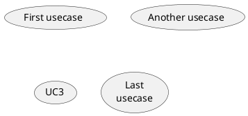

## 演员

定义一个演员的名字被括在冒号之间。

你也可以使用actor 关键字来定义一个行为体。 一个别名可以使用as 关键字来指定，并且可以在以后代替行为体的名称，例如在定义关系时使用。

你可以从下面的例子中看到，演员的定义是可选的。

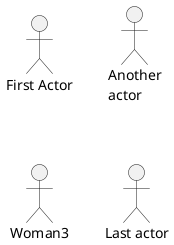

## 改变角色的样式

可以将角色的样式从默认的火柴人改成：
用户头像样式：skinparam actorStyle awesome
透明人样式：skinparam actorStyle hollow

### 火柴人 默认

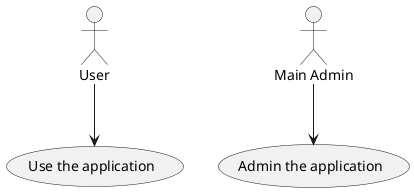

### 用户头像

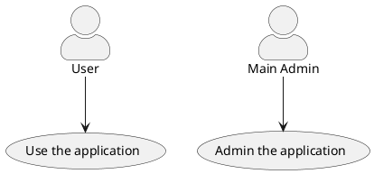

[参见 QA-10493]

### 透明人

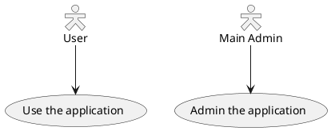

[参见 PR#396]

## 用例描述

如果想定义跨越多行的用例描述，可以用双引号将其裹起来。

还可以使用这些分隔符：
--（横线）
..（虚线）
==（双横线）
__（下划线）
并且还可以在分隔符中间放置标题。

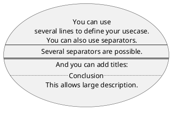

## 使用包

您可以一使用包来对角色或用例进行分组。

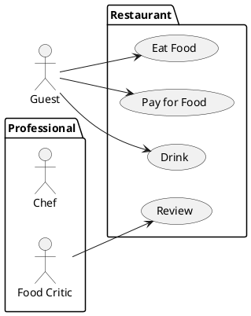

您可以使用rectangle来改变包的外观。

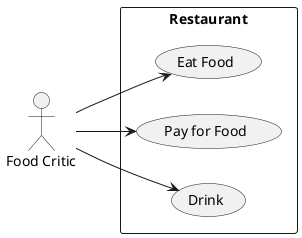

## 基础示例

用箭头-->连接角色和用例。

横杠-越多，箭头越长。 通过在箭头定义的后面加一个冒号及文字的方式来添加标签。

在这个例子中，User并没有定义，而是直接拿来当做一个角色使用。

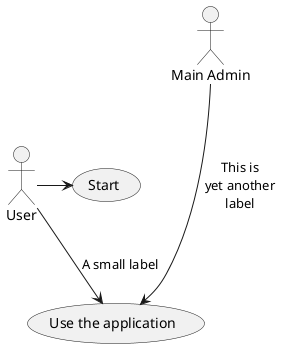

## 继承

如果一个角色或者用例继承于另一个，那么可以用<|--符号表示。

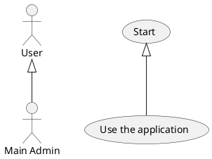

## 使用注释

可以用note left of , note right of , note top of , note bottom of等关键字给一个对象添加注释。

注释还可以通过note关键字来定义，然后用..连接其他对象。

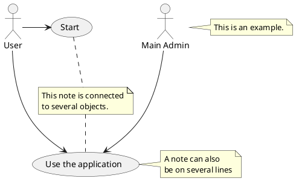

## 构造类型

用 << 和 >> 来定义角色或者用例的构造类型。

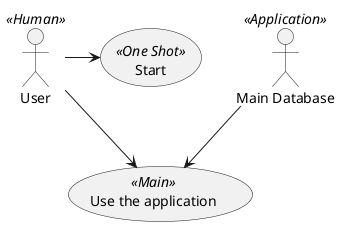

## 改变箭头方向

默认情况下，类之间的链接有两个破折号-- ，并且是垂直方向的。 可以通过像这样放一个破折号（或点）来使用水平链接。

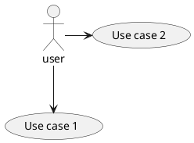

你也可以通过反转链接来改变方向。

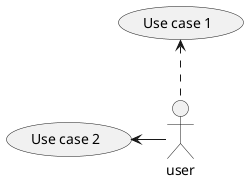

也可以通过在箭头内添加left,right,up 或down 关键字来改变箭头方向。

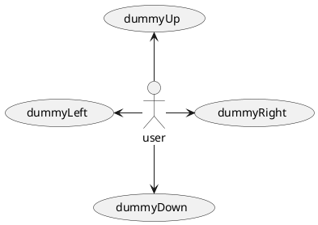

你可以通过只使用方向的第一个字符来缩短箭头（例如，-d- ，而不是 -down- ） 或两个第一个字符(-do-)。

请注意，你不应该滥用这个功能：Graphviz通常在没有 调整的情况下给出良好的结果。

并使用 left to right direction参数。

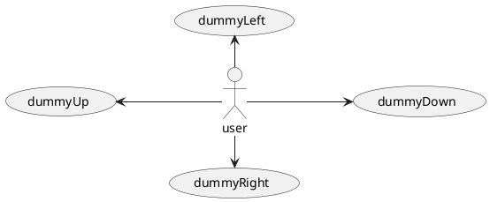

## 分割图示

用newpage关键字将图示分解为多个页面。

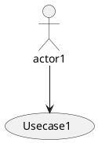

## 从左向右方向

默认从上往下构建图示。

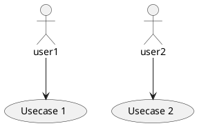

你可以用left to right direction命令改变图示方向。

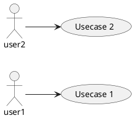

## 显示参数

用skinparam改变字体和颜色。

可以在如下场景中使用：
* 在图示的定义中，
* 在引入的文件中，
* 在命令行或者ANT任务提供的配置文件中。

你也可以给构造的角色和用例指定特殊颜色和字体。

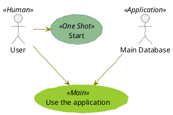

## 完整样例

```plantuml
@startuml
left to right direction
skinparam packageStyle rectangle
actor customer
actor clerk
rectangle checkout {
  customer -- (checkout)
  (checkout) .> (payment) : include
  (help) .> (checkout) : extends
  (checkout) -- clerk
}
@enduml
```

## 业务用例

你可以添加/ 来制作业务用例。

### 业务用例

```plantuml
@startuml

(First usecase)/
(Another usecase)/ as (UC2)
usecase/ UC3
usecase/ (Last\nusecase) as UC4

@enduml
```

### 商业行为者

```plantuml
@startuml

:First Actor:/
:Another\nactor:/ as Man2
actor/ Woman3
actor/ :Last actor: as Person1

@enduml
```

[Ref.QA-12179]

## 改变箭头的颜色和样式（内联样式）

你可以使用以下的内联式符号改变单个箭头的颜色或样式。

#color;line.[bold|dashed|dotted];text:color

```plantuml
@startuml
actor foo
foo --> (bar) : normal
foo --> (bar1) #line:red;line.bold;text:red  : red bold
foo --> (bar2) #green;line.dashed;text:green : green dashed 
foo --> (bar3) #blue;line.dotted;text:blue   : blue dotted
@enduml
```

## 改变元素的颜色和样式（内联样式）

你可以用以下符号改变单个元素的颜色或样式。
#[color|back:color];line:color;line.[bold|dashed|dotted];text:color

```plantuml
@startuml
actor a
actor b #pink;line:red;line.bold;text:red
usecase c #palegreen;line:green;line.dashed;text:green
usecase d #aliceblue;line:blue;line.dotted;text:blue
@enduml
```

[参考QA-5340和改编自QA-6852]

## 显示 JSON 数据

```plantuml
@startuml
allowmixing

actor     用户
usecase   用例

json JSON {
   "水果":"苹果",
   "尺寸":"大",
   "颜色": ["红", "绿"]
}
@enduml
```
