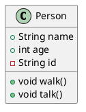
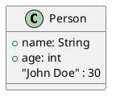
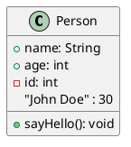
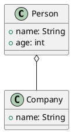
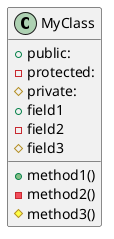
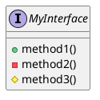
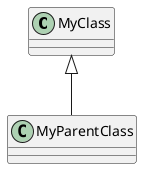
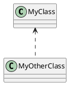

# PlantUML 教程

## 目录

1. 章节1

   1.1. 1.1 PlantUML 简介

   1.2. 1.2 PlantUML 优势

2. 章节2

   2.1. 2.1 安装 PlantUML

   2.2. 2.2 配置 PlantUML

3. 章节3

   3.1. 3.1 基础语法

   3.2. 3.2 UML 元素

4. 章节4

   4.1. 4.1 创建类图

   4.2. 4.2 创建用例图

5. 章节5

   5.1. 5.1 创建时序图

   5.2. 5.2 创建协作图

6. 章节6

   6.1. 6.1 创建活动图

   6.2. 6.2 创建状态图

7. 章节7

   7.1. 7.1 PlantUML 实战

   7.2. 7.2 常见问题解答

---

# PlantUML 教程

## 章节1：PlantUML 入门

### 1.1 PlantUML 简介

PlantUML 是一个开源的、基于文本的绘图工具，它允许用户使用简单的文本语法来创建各种类型的图表，如类图、对象图、用例图、时序图、状态图、活动图等。PlantUML 的强大之处在于其易用性和灵活性，它能够帮助开发者、设计师和文档编写者快速、直观地表达复杂的概念和设计。

### 1.1.1 PlantUML 的特点

- **易用性**：PlantUML 使用简单的文本语法，无需学习复杂的图形编辑器。
- **灵活性**：支持多种图表类型，可以满足不同的绘图需求。
- **跨平台**：可以在多种操作系统上运行，如 Windows、Linux 和 macOS。
- **集成**：可以与多种编辑器和开发环境集成，如 IntelliJ IDEA、Eclipse、Visual Studio Code 等。

### 1.1.2 PlantUML 的应用场景

- **软件开发**：用于设计类图、对象图、时序图、状态图等，帮助开发者理解、交流和实现软件设计。
- **系统架构**：用于绘制系统架构图，帮助系统设计师和架构师更好地理解系统结构和组件关系。
- **文档编写**：用于创建流程图、用例图、活动图等，帮助文档编写者更清晰地表达设计思路和业务流程。

### 1.1.3 PlantUML 的语法

PlantUML 的语法非常简单，以下是一些基本的语法示例：

- **类图**：
  ```plantuml
  @startuml
  class Person {
    +String name
    +int age
    -String id
  }
  @enduml
  ```
  上面的代码定义了一个名为 `Person` 的类，包含三个属性：`name`、`age` 和 `id`。

- **时序图**：
  ```plantuml
  @startuml
  Alice -> Bob: Hello!
  Bob --> Alice: Hi!
  @enduml
  ```
  上面的代码定义了一个简单的时序图，展示了 Alice 和 Bob 之间的对话。

- **状态图**：
  ```plantuml
  @startuml
  StateMachine[*] --> Initial
  Initial --> Active
  Active --> Inactive
  Inactive --> Active
  @enduml
  ```
  上面的代码定义了一个状态图，展示了状态机从初始状态到活动状态，再到不活动状态，并可以再次回到活动状态的转换过程。

### 1.1.4 PlantUML 的安装与使用

PlantUML 支持多种安装方式，以下是在 Windows 系统上安装 PlantUML 的步骤：

1. 下载 PlantUML 的 Windows 版本。
2. 解压下载的文件到指定目录。
3. 将 PlantUML 的可执行文件路径添加到系统环境变量中。
4. 打开命令提示符，输入 `plantuml -version` 检查 PlantUML 是否安装成功。

安装成功后，您可以使用 PlantUML 的语法在文本编辑器中编写图表，然后通过命令行运行 PlantUML 命令来生成图表。例如，使用以下命令生成类图：

```shell
plantuml -pJ class diagram.txt
```

其中，`class diagram.txt` 是包含 PlantUML 语法的文本文件，`-pJ` 参数表示生成 JPEG 格式的图片。

通过以上内容，您应该对 PlantUML 有了一个基本的了解。接下来，我们将继续学习 PlantUML 的更多高级功能和图表类型。
---

# PlantUML 教程
## 章节1：初识 PlantUML
### 1.2 PlantUML 优势

PlantUML 是一种非常流行的开源绘图工具，它允许用户使用简单的文本标记来创建各种类型的图表，如类图、序列图、用例图、时序图、活动图等。以下列举了 PlantUML 的几个主要优势：

### 1.2.1 易于学习和使用

PlantUML 的语法非常简单直观，即使没有图形设计背景的用户也可以快速上手。它的语法类似于自然语言，使得用户可以轻松地编写描述图表的文本。

### 1.2.2 丰富的图表类型

PlantUML 支持多种图表类型，包括但不限于以下几种：

- **类图（Class Diagram）**：用于展示软件中类的结构和关系。
- **序列图（Sequence Diagram）**：展示对象之间交互的顺序和时序。
- **用例图（Use Case Diagram）**：描述系统的功能和用户与系统交互的方式。
- **时序图（Timing Diagram）**：展示对象之间的时序关系。
- **活动图（Activity Diagram）**：描述系统中的工作流程。

### 1.2.3 可扩展性和定制性

PlantUML 允许用户通过扩展其语法和内置元素来创建自定义的图表类型。这意味着用户可以根据自己的需求自定义图表的样式、颜色和布局。

### 1.2.4 集成性和跨平台性

PlantUML 可以与多种编辑器和集成开发环境（IDE）集成，如 Visual Studio Code、Eclipse、IntelliJ IDEA 等。此外，它支持多种编程语言和平台，包括 Java、Python、Ruby、JavaScript 等。

### 1.2.5 自动生成图表

PlantUML 的一个重要特性是能够将文本描述自动转换为相应的图表。用户只需要编写一个简单的文本文件，PlantUML 就会根据这个文件的内容生成图表。这使得 PlantUML 在文档编写、演示和代码注释等领域非常受欢迎。

### 1.2.6 社区支持和资源丰富

PlantUML 拥有活跃的社区，提供了大量的教程、示例和插件。用户可以在社区中找到解决问题的答案，也可以贡献自己的经验和资源。

### 示例代码

以下是一个简单的 PlantUML 类图示例，用于展示一个简单的类及其属性和方法：



在这个示例中，我们定义了一个 `Person` 类，它有四个属性（`name`、`age`、`id`）和两个方法（`walk`、`talk`）。使用 PlantUML 的语法，我们可以轻松地创建出这样的图表。
---

# PlantUML 教程
## 章节 2
### 2.1 安装 PlantUML

在开始使用 PlantUML 之前，我们需要首先将其安装在您的计算机上。PlantUML 是一个开源的绘图工具，可以生成各种类型的图表，如类图、时序图、用例图等。以下是不同操作系统下安装 PlantUML 的详细步骤：

### Windows 系统

1. **下载 PlantUML 安装包**：
   访问 PlantUML 官方网站 [PlantUML](http://plantuml.com/)，下载适用于 Windows 的安装包。选择与您操作系统相匹配的版本。

2. **安装 PlantUML**：
   双击下载的安装包，按照提示进行安装。在安装过程中，可以选择将 PlantUML 添加到系统环境变量中，以便在命令行中直接运行。

3. **验证安装**：
   打开命令提示符（CMD），输入以下命令来验证 PlantUML 是否安装成功：

   ```plaintext
   plantuml -version
   ```

   如果看到类似 `plantuml 1.3.11` 的版本信息，说明 PlantUML 安装成功。

### macOS 系统

1. **使用 Homebrew 安装**：
   如果您的 macOS 系统已经安装了 Homebrew，可以直接使用以下命令安装 PlantUML：

   ```plaintext
   brew install plantuml
   ```

   如果您还没有安装 Homebrew，请先通过以下命令安装：

   ```plaintext
   /bin/bash -c "$(curl -fsSL https://raw.githubusercontent.com/Homebrew/install/HEAD/install.sh)"
   ```

2. **验证安装**：
   在终端中输入以下命令来验证 PlantUML 是否安装成功：

   ```plaintext
   plantuml -version
   ```

### Linux 系统

1. **使用包管理器安装**：
   对于基于 Debian 的 Linux 发行版（如 Ubuntu），可以使用以下命令安装 PlantUML：

   ```plaintext
   sudo apt-get update
   sudo apt-get install plantuml
   ```

   对于基于 RPM 的 Linux 发行版（如 CentOS），可以使用以下命令安装 PlantUML：

   ```plaintext
   sudo yum install plantuml
   ```

2. **验证安装**：
   打开终端，输入以下命令来验证 PlantUML 是否安装成功：

   ```plaintext
   plantuml -version
   ```

### 总结

通过以上步骤，您已经成功安装了 PlantUML。现在，您可以使用 PlantUML 创建各种图表，并将其嵌入到文档、演示文稿或代码中。在下一节中，我们将学习如何编写 PlantUML 代码并生成图表。
---

# PlantUML 教程
## 章节 2.2 配置 PlantUML

### 2.2.1 概述
配置 PlantUML 是使用 PlantUML 的第一步，它涉及到设置 PlantUML 的运行环境，包括选择合适的 PlantUML 发行版、安装和配置 PlantUML 解释器以及集成到你的开发工具中。

### 2.2.2 选择 PlantUML 发行版
PlantUML 有多个发行版，包括 Java、JavaScript 和 Ruby 等。Java 版本是最常用的，因为它易于集成到各种开发环境中。

#### Java 版本
- **优势**：易于集成到各种开发环境中，如 IntelliJ IDEA、Eclipse 等。
- **下载**：访问 [PlantUML 官网](http://plantuml.com/) 下载 Java 版本的 PlantUML。

### 2.2.3 安装 PlantUML 解释器
以下是不同操作系统中安装 PlantUML 的步骤：

#### Windows 系统
1. 下载 Java 版本的 PlantUML。
2. 解压下载的文件到指定的文件夹。
3. 在系统环境变量 `Path` 中添加 PlantUML 解压后的路径。

#### macOS 系统
1. 打开终端。
2. 使用 `brew install plantuml` 命令进行安装。

#### Linux 系统
1. 使用包管理器安装。例如，在 Ubuntu 中，可以使用以下命令：
   ```
   sudo apt-get update
   sudo apt-get install plantuml
   ```

### 2.2.4 配置 PlantUML
安装完成后，你需要配置 PlantUML 以确保它能够正确运行。

#### 配置 PlantUML 解释器
- 在命令行中输入 `plantuml -version`，如果显示版本信息，则表示 PlantUML 解释器已正确安装。
- 如果需要配置图形渲染器（如 Graphviz），可以在 PlantUML 的配置文件中设置。配置文件通常位于用户的主目录下，文件名为 `.plantuml`。

#### 集成到开发工具
以下是几种常见开发工具中集成 PlantUML 的方法：

#### IntelliJ IDEA
1. 打开 IntelliJ IDEA，选择 `File` > `Settings`。
2. 在左侧菜单中选择 `Build, Execution, Deployment` > `PlantUML`。
3. 在 `PlantUML JAR Path` 字段中输入 PlantUML 解压后的路径。

#### Eclipse
1. 打开 Eclipse，选择 `Window` > `Preferences`。
2. 在左侧菜单中选择 `PlantUML`。
3. 在 `PlantUML JAR Path` 字段中输入 PlantUML 解压后的路径。

### 2.2.5 总结
通过上述步骤，你已经成功配置了 PlantUML。现在，你可以开始使用 PlantUML 创建各种图表，如图谱、流程图、时序图等。在接下来的章节中，我们将学习如何使用 PlantUML 的语法来创建不同的图表。
---

# PlantUML 教程
## 章节3 基础语法
### 3.1 基础语法

PlantUML 是一种用自然语言描述 UML 图的简单语言。它允许开发者通过编写简单的文本来生成各种 UML 图，如类图、时序图、用例图等。本节将介绍 PlantUML 的基础语法，帮助您快速上手。

### 3.1.1 图的定义

在 PlantUML 中，每个 UML 图都是以 `@startuml` 开头，以 `@enduml` 结尾的。例如：



上述代码定义了一个类图，其中包含一个名为 `Person` 的类，它有两个属性：`name` 和 `age`。接着，我们创建了一个 `Person` 对象，并初始化了它的属性。

### 3.1.2 类的定义

在 PlantUML 中，类的定义使用 `class` 关键字。类名后跟一对花括号 `{}`，其中包含类的属性和方法。属性和方法之间用冒号 `:` 分隔。



在上面的代码中，`Person` 类有三个属性：`name`、`age` 和 `id`，以及一个方法 `sayHello()`。

### 3.1.3 关联的定义

在 UML 图中，关联表示类之间的连接。在 PlantUML 中，关联的定义使用 `..>` 或 `<..` 符号。



上述代码定义了一个关联，表示 `Person` 类与 `Company` 类之间的关系。

### 3.1.4 继承的定义

在 PlantUML 中，继承使用 `<:` 符号表示。

```plantuml
@startuml
class Person {
  +name: String
  +age: int
}

class Employee <: Person {
  +salary: double
}

Employee : "John Doe" : 30
@enduml
```

上述代码定义了一个 `Employee` 类，它继承自 `Person` 类，并添加了一个新的属性 `salary`。

### 3.1.5 实例化对象

在 PlantUML 中，实例化对象使用 `: "对象名"` 的格式。


上述代码创建了一个名为 `John Doe` 的 `Person` 对象，并初始化了它的属性。

通过以上基础语法的介绍，您应该已经对 PlantUML 有了一定的了解。接下来，您可以尝试使用这些语法来绘制各种 UML 图，以便更好地理解和设计您的软件系统。
---

# PlantUML 教程
## 章节 3 UML 元素

### 3.2 UML 元素

UML（统一建模语言）是一种用于软件系统建模的语言，它提供了丰富的图形元素来表示软件系统的不同组成部分及其关系。在PlantUML中，我们可以使用多种UML元素来创建不同的图形，包括类图、用例图、序列图等。

#### 3.2.1 类

类是UML中最基本的元素，用于表示软件系统中的对象。在PlantUML中，类可以用以下语法表示：



在上面的代码中，`MyClass` 是一个类的名称。`+public`、`-protected` 和 `#private` 分别表示公共、受保护和私有属性。`field1`、`field2` 和 `field3` 是类的属性，而 `method1()`、`method2()` 和 `method3()` 是类的方法。

#### 3.2.2 接口

接口是UML中用于定义一组方法的元素，它表示一组抽象的方法。在PlantUML中，接口可以用以下语法表示：



在上面的代码中，`MyInterface` 是一个接口的名称。`method1()`、`method2()` 和 `method3()` 是接口中的方法。

#### 3.2.3 关联

关联表示两个类之间的关系。在PlantUML中，关联可以用以下语法表示：


在上面的代码中，`MyClass` 和 `MyOtherClass` 之间存在一个关联。箭头指向关联的目标类。

#### 3.2.4 继承

继承表示一个类继承另一个类的属性和方法。在PlantUML中，继承可以用以下语法表示：



在上面的代码中，`MyClass` 继承自 `MyParentClass`。

#### 3.2.5 实现关系

实现关系表示一个类实现了另一个类的接口。在PlantUML中，实现关系可以用以下语法表示：

```plantuml
@startuml
MyClass implements MyInterface
@enduml
```

在上面的代码中，`MyClass` 实现了 `MyInterface` 接口。

#### 3.2.6 聚合

聚合表示一个类包含另一个类，但它们之间没有继承关系。在PlantUML中，聚合可以用以下语法表示：


在上面的代码中，`MyClass` 包含了 `MyOtherClass`。

#### 3.2.7 组合

组合表示一个类拥有另一个类，并且它们之间有强依赖关系。在PlantUML中，组合可以用以下语法表示：


在上面的代码中，`MyClass` 拥有 `MyOtherClass`。

#### 3.2.8 组合关系

组合关系表示一个类与另一个类之间的组合关系。在PlantUML中，组合关系可以用以下语法表示：



在上面的代码中，`MyClass` 与 `MyOtherClass` 之间存在组合关系。

通过以上内容，您应该已经了解了PlantUML中的基本UML元素及其语法。在实际的软件系统建模中，这些元素可以组合使用，以创建复杂的UML图形。
---

# PlantUML 教程
## 章节4 创建类图
### 4.1 创建类图

类图是面向对象设计中的一种重要工具，它用于描述系统中类的结构和类之间的关系。PlantUML 是一个简单的图形工具，它允许用户通过简单的文本标记来创建各种类型的 UML 图，包括类图。本节将详细介绍如何使用 PlantUML 创建类图。

### 类图的基本概念

在 PlantUML 中，创建类图主要包括以下几个基本概念：

- 类（Class）：表示软件中的对象，通常由名称、属性和方法组成。
- 属性（Attribute）：类的属性定义了类的静态特征。
- 方法（Method）：类的方法定义了类的行为。
- 关系（Association）：表示类与类之间的连接。
- 泛化（Generalization）：表示继承关系。
- 实现（Realization）：表示类实现接口。
- 组合（Composition）：表示强依赖关系。
- 聚合（Aggregation）：表示弱依赖关系。

### 创建类图的步骤

1. **定义类**：首先定义一个类，包括类的名称、属性和方法。

   ```plantuml
   @startuml
   class Person {
       String name
       int age
       void walk()
       void talk()
   }
   @enduml
   ```

2. **添加属性和方法**：在类定义中添加属性和方法。

3. **创建关系**：在类之间创建关系，如关联、泛化、实现、组合和聚合。

   ```plantuml
   @startuml
   class Person {
       String name
       int age
       void walk()
       void talk()
   }
   
   class Student {
       Person teacher
       String major
   }
   
   Person o1 :up: "Student"
   @enduml
   ```

4. **添加约束和修饰符**：为类、属性和方法添加约束和修饰符，如 `+` 表示公共（public）、`-` 表示私有（private）、`#` 表示受保护（protected）。

   ```plantuml
   @startuml
   class Person {
       +String name
       -int age
       void walk()
       public void talk()
   }
   @enduml
   ```

5. **调整布局和样式**：使用 PlantUML 的布局和样式选项来调整类图的布局和外观。

   ```plantuml
   @startuml
   layout LeftToRight
   class Person {
       +String name
       -int age
       void walk()
       public void talk()
   }
   @enduml
   ```

### 总结

通过以上步骤，你可以使用 PlantUML 创建简单的类图。在实际应用中，你可能需要创建更复杂的类图，包括多个类、关系和约束。PlantUML 提供了丰富的语法和选项，可以帮助你轻松地创建美观且功能强大的类图。在实践中不断练习和探索，你将能够更好地掌握 PlantUML 的使用技巧。
---

# PlantUML 教程
## 章节4：创建用例图

### 4.2 创建用例图

用例图是UML（统一建模语言）中用于描述系统与外部参与者（用户或系统）之间交互的图形。在用例图中，系统被表示为矩形，参与者被表示为小人图标，用例被表示为椭圆。本节将详细介绍如何使用PlantUML创建用例图。

### 4.2.1 用例图的基本元素

在PlantUML中，创建用例图需要以下基本元素：

- **参与者（Actor）**：代表与系统交互的外部实体，如用户、其他系统或设备。
- **用例（Use Case）**：代表系统执行的功能，用椭圆表示。
- **系统边界**：用矩形表示，包含所有用例和参与者。
- **关联（Association）**：表示参与者与用例之间的关系，用线条表示。
- **泛化（Generalization）**：表示用例之间的继承关系，用空心三角形表示。
- **依赖（Dependency）**：表示用例之间的依赖关系，用虚线表示。

### 4.2.2 创建用例图的步骤

1. **定义参与者**：首先，确定与系统交互的参与者，并在PlantUML中用小人图标表示。

2. **定义用例**：接着，确定系统需要执行的功能，用椭圆表示，并给出用例的名称。

3. **绘制系统边界**：将所有用例和参与者放入矩形中，表示系统边界。

4. **添加关联**：用线条连接参与者和用例，表示它们之间的关系。

5. **添加泛化和依赖**：如果需要表示用例之间的继承或依赖关系，可以使用泛化和依赖关系。

### 4.2.3 代码示例

以下是一个简单的用例图示例：

```plantuml
@startuml
actor 用户
usecase 登录
usecase 查看订单
usecase 下订单
system 网上书店系统

用户 -- 登录
用户 -- 查看订单
用户 -- 下订单
@enduml
```

在这个示例中，我们定义了一个名为“用户”的参与者，以及三个用例：登录、查看订单和下订单。用户与这三个用例之间存在关联关系。

### 4.2.4 总结

通过本节的学习，您应该已经掌握了如何使用PlantUML创建用例图。用例图是描述系统功能的重要工具，可以帮助您更好地理解系统与外部参与者之间的交互。在实际项目中，您可以使用PlantUML绘制用例图，以便与团队成员进行沟通和协作。
---

# PlantUML 教程
## 章节 5. 创建时序图

### 5.1 创建时序图

时序图（Sequence Diagram）是 PlantUML 中的一个重要图表类型，它用于展示对象之间在时间上的交互顺序。本小节将详细介绍如何在 PlantUML 中创建时序图。

### 5.1.1 时序图的基本元素

在 PlantUML 中，时序图主要由以下元素构成：

- ** lifeline **：表示一个参与交互的对象，通常以竖线表示。
- ** actor **：表示外部参与者，通常以一个小人图标表示。
- ** message **：表示对象之间的交互，分为同步消息（实线）和异步消息（虚线）。
- ** activation **：表示对象的活动时间，通常以矩形框表示。

### 5.1.2 时序图的基本语法

以下是一个简单的时序图示例：

```plantuml
@startuml
actor User
object Order
User -> Order : Place order
activate Order
Order -> Order : Process order
deactivate Order
@enduml
```

在这个示例中，我们定义了一个用户（User）和一个订单对象（Order）。用户向订单对象发送了一个“Place order”消息，然后订单对象进入活动状态，执行“Process order”操作，最后退出活动状态。

### 5.1.3 时序图的高级特性

PlantUML 时序图支持以下高级特性：

- **创建 lifeline **：使用 `class` 关键字定义一个类，然后使用 `object` 关键字创建一个对象实例，例如：

```plantuml
class Order {
  +id
  +name
  +date
}

Order order1 : new Order()
```

- **创建 actor **：使用 `actor` 关键字定义一个外部参与者，例如：

```plantuml
actor User
```

- **创建消息 **：使用 `->` 和 `-->` 分别表示同步消息和异步消息，例如：

```plantuml
User -> Order : Place order
Order --(timeout)--> User : Order placed
```

- **创建激活 **：使用 `activate` 和 `deactivate` 关键字表示对象的活动时间，例如：

```plantuml
User -> Order : Place order
activate Order
Order -> Order : Process order
deactivate Order
```

### 5.1.4 时序图实例

以下是一个更复杂的时序图实例，展示了用户登录、订单支付、订单发货的过程：

```plantuml
@startuml
actor User
object Order
object Payment
object Shipping

User -> Order : Login
activate Order
Order -> Payment : Pay order
activate Payment
Payment -> User : Payment approved
deactivate Payment
Order -> Shipping : Ship order
activate Shipping
Shipping -> User : Order shipped
deactivate Shipping
deactivate Order
@enduml
```

在这个实例中，我们展示了用户（User）与订单（Order）、支付（Payment）和发货（Shipping）对象之间的交互过程。

通过以上内容，您应该已经掌握了在 PlantUML 中创建时序图的基本方法和高级特性。接下来，您可以尝试自己绘制时序图，以展示对象之间的交互关系。
---

# PlantUML 教程
## 章节5：创建协作图

### 5.2 创建协作图

协作图（Collaboration Diagram）是UML（统一建模语言）中用于描述对象之间交互关系的一种图。它展示了对象之间的消息传递和协作过程，通常用于展示软件系统中的类和对象之间的交互。

#### 5.2.1 基本语法

在PlantUML中，创建协作图的基本语法如下：

```plantuml
@startuml
actor "参与者1" as Alice
actor "参与者2" as Bob
participant "参与者3" as Carol

Alice -> Bob: 消息1
Bob -> Carol: 消息2
Alice -> Carol: 消息3

@enduml
```

在上面的代码中，我们定义了三个参与者：Alice、Bob和Carol。然后，我们通过箭头表示消息传递，箭头从发送者指向接收者。

#### 5.2.2 参与者

参与者是协作图中的主要元素，表示实际参与交互的角色。在PlantUML中，可以使用以下语法定义参与者：

- `actor "参与者名称"`：定义一个参与者。
- `participant "参与者名称"`：定义一个参与者。

例如：

```plantuml
actor "用户" as User
participant "系统" as System
```

#### 5.2.3 消息

消息是参与者之间传递的信息。在PlantUML中，可以使用以下语法定义消息：

- `发送者 -> 接收者: 消息内容`：定义一个消息，从发送者指向接收者。

例如：

```plantuml
User -> System: 登录请求
System -> User: 登录成功
```

#### 5.2.4 生命线

生命线表示参与者在协作图中的存在时间。在PlantUML中，可以使用以下语法定义生命线：

- `发送者: [开始时间] - [结束时间]`：定义一个参与者的生命线。

例如：

```plantuml
User: [2023-01-01] - [2023-01-02]
```

#### 5.2.5 代码示例

以下是一个简单的协作图示例，展示了用户登录系统的过程：

```plantuml
@startuml
actor "用户" as User
participant "系统" as System

User -> System: 登录请求
System -> User: 验证用户名
User -> System: 输入用户名
System -> User: 验证密码
User -> System: 输入密码
System -> User: 登录成功

@enduml
```

在这个示例中，用户首先向系统发送登录请求，然后系统要求用户输入用户名和密码，最后验证用户名和密码，并返回登录成功的信息。

#### 5.2.6 总结

通过本节的学习，您应该已经掌握了如何使用PlantUML创建协作图。协作图可以帮助您更好地理解对象之间的交互关系，从而提高软件系统的可维护性和可扩展性。在实际项目中，您可以根据需要调整协作图的结构和内容，以适应不同的场景。
---

# PlantUML 教程
## 章节6：创建活动图

### 6.1 创建活动图

活动图是一种UML图，用于描述系统中的业务流程、程序中的控制流程或对象间的交互。它展示了系统执行过程中各个步骤的顺序，以及决策点。本节将详细讲解如何在PlantUML中创建活动图。

### 6.1.1 活动图基本元素

在活动图中，常用的基本元素包括：

- **活动节点**：表示业务流程中的操作或任务。
- **决策节点**：表示业务流程中的决策点，通常以菱形表示。
- **分支节点**：表示活动图中不同路径的入口或出口。
- **开始/结束节点**：表示业务流程的开始或结束。
- **对象节点**：表示参与活动的人员、组织或系统。

### 6.1.2 创建活动图的基本语法

创建活动图的基本语法如下：

```plantuml
@startuml

[*] --> Activity1
Activity1 --> Decision1
Decision1 --> (yes)
Decision1 --> (no)
yes --> Activity2
no --> Activity3
Activity2 --> End
Activity3 --> End

@enduml
```

### 6.1.3 代码示例解析

- `@startuml` 和 `@enduml` 分别表示PlantUML文档的开始和结束。
- `[*] --> Activity1` 表示从初始节点（星号）指向第一个活动节点。
- `Activity1 --> Decision1` 表示从活动节点指向决策节点。
- `Decision1 --> (yes)` 和 `Decision1 --> (no)` 表示决策节点的两个分支。
- `yes --> Activity2` 和 `no --> Activity3` 表示决策分支后的活动节点。
- `Activity2 --> End` 和 `Activity3 --> End` 表示活动节点指向结束节点。

### 6.1.4 高级特性

- **并行活动**：使用 `|||` 表示并行执行的活动。
- **循环**：使用 `while` 或 `for` 关键字表示循环。
- **异常处理**：使用 `try-catch` 语句处理异常。

### 6.1.5 活动图示例

以下是一个简单的活动图示例，展示了学生选课的业务流程：

```plantuml
@startuml

[*] --> StartActivity
StartActivity --> StudentSelectCourse
StudentSelectCourse --> CourseAvailable
CourseAvailable --> (yes)
CourseAvailable --> (no)
yes --> StudentEnrollCourse
no --> NoCourseAvailable
StudentEnrollCourse --> EndActivity
NoCourseAvailable --> EndActivity

@enduml
```

在这个示例中，我们从初始节点开始，经过学生选课、课程可用性判断、学生注册课程等步骤，最终到达结束节点。

通过以上内容，您应该能够掌握在PlantUML中创建活动图的基本方法和技巧。在接下来的实践中，您可以尝试使用PlantUML绘制更多复杂的活动图，以更好地理解和表达您的业务流程。
---

# PlantUML 教程
## 章节 6.2 创建状态图

状态图（State Diagram）是UML（统一建模语言）中的一种图表，用于描述一个对象在其生命周期中的状态变化以及触发这些变化的事件。在PlantUML中，创建状态图非常简单，只需要按照特定的语法规则编写相应的代码即可。

### 6.2.1 状态图的基本元素

在PlantUML中，状态图的基本元素包括：

- **状态（State）**：表示对象在某一时刻所处的状态，通常用圆角矩形表示。
- **初始状态（Initial State）**：表示对象开始时的状态，通常用带有圆环的圆角矩形表示。
- **活动状态（Active State）**：表示对象正在进行的活动，通常用带有短横线的圆角矩形表示。
- **终止状态（Final State）**：表示对象的生命周期结束的状态，通常用实心圆角矩形表示。
- **事件（Event）**：表示触发状态变化的原因，通常用菱形表示。
- **转换（Transition）**：表示从一个状态到另一个状态的变化，通常用带箭头的线表示。

### 6.2.2 状态图的语法

在PlantUML中，创建状态图的语法如下：

```markdown
[*] --> InitialState : 初始状态
State1 --> State2 : 事件1
State2 --> State3 : 事件2
State3 --> FinalState : 事件3
```

在上面的代码中，`[*]`表示初始状态，`State1`, `State2`, `State3`分别表示不同的状态，`FinalState`表示终止状态。箭头表示状态之间的转换，冒号后面的文本表示触发转换的事件。

### 6.2.3 代码示例

以下是一个简单的状态图示例：

```markdown
[*] --> InitialState : 初始状态
State1 --> State2 : 用户登录
State2 --> State3 : 用户操作
State3 --> State2 : 用户退出
State3 --> FinalState : 用户注销
```

在这个例子中，用户首先进入初始状态，然后登录系统，进入活动状态。在活动状态下，用户进行操作，如果用户退出，则回到活动状态，如果用户注销，则进入终止状态。

### 6.2.4 高级特性

PlantUML还支持许多高级特性，如并发状态、历史状态、注释等。以下是一些常用的高级特性：

- **并发状态（Concurrent State）**：表示对象可以同时处于多个状态，通常用嵌套的圆角矩形表示。
- **历史状态（History State）**：表示对象在状态转换过程中可能返回到之前的状态，通常用带有斜线的圆角矩形表示。
- **注释（Note）**：用于在状态图中添加注释，通常用短横线表示。

通过以上介绍，相信你已经对PlantUML中的状态图有了基本的了解。在实际应用中，你可以根据需要添加更多元素和特性，以更好地描述你的系统状态变化。
---

#PlantUML 教程
## 章节7：PlantUML 实战
### 7.1 PlantUML 实战

在本节中，我们将通过具体的例子来讲解如何使用 PlantUML 进行绘图。PlantUML 支持多种图形表示，包括时序图、活动图、类图、对象图、组件图、用例图等。下面我们将以时序图和类图为例，展示如何使用 PlantUML 进行实际绘图。

### 时序图

时序图主要用于描述对象之间在时间上的交互顺序。以下是一个简单的时序图示例，展示了用户登录系统的过程：

```plantuml
@startuml
actor 用户
participant 系统接口
用户 -> 系统接口: 登录请求
系统接口 -> 系统接口: 验证用户
alt 验证成功
系统接口 -> 用户: 登录成功
else 验证失败
系统接口 -> 用户: 登录失败
end
@enduml
```

### 类图

类图用于描述系统中类的结构，包括类之间的关系。以下是一个简单的类图示例，展示了用户和角色之间的关系：

```plantuml
@startuml
class 用户 {
  +用户名: String
  +密码: String
  +角色: 角色
}

class 角色 {
  +名称: String
}

用户 o-- 角色: 属于
@enduml
```

### 实战步骤

1. **安装 PlantUML**：首先需要安装 PlantUML 工具，可以从官方网址 https://plantuml.com/ 下载安装包。

2. **编写 PlantUML 代码**：使用 PlantUML 语法编写图形代码。以上时序图和类图的代码可以作为参考。

3. **生成图形文件**：将 PlantUML 代码保存为 `.puml` 文件，然后使用 PlantUML 工具生成对应的图形文件。在命令行中运行以下命令：

```bash
java -jar plantuml.jar 文件名.puml
```

4. **查看结果**：生成图形文件后，你可以在命令行中查看生成的图形，或者将图形文件插入到文档、报告中。

通过以上步骤，你就可以使用 PlantUML 进行实际绘图了。PlantUML 支持丰富的语法和功能，你可以根据自己的需求，探索更多高级功能。
---

# PlantUML 教程
## 章节7：常见问题解答
### 7.2 常见问题解答

本章节将针对 PlantUML 使用过程中可能会遇到的一些常见问题进行解答，帮助您更好地理解和运用 PlantUML。

### 问题1：如何定义类属性和操作？

在 PlantUML 中，定义类属性和操作通常使用以下语法：

```plantuml
@startuml

class MyClass {
  +public int number
  -protected String name
  #private boolean isActive
  +void printNumber()
  -void setName(String name)
  #void setActive(boolean isActive)
}

@enduml
```

在这个例子中，`MyClass` 是一个类，它包含三个属性：`number`、`name` 和 `isActive`。这些属性分别被标记为 `public`、`protected` 和 `private`，表示它们的访问权限。同时，还定义了三个方法：`printNumber`、`setName` 和 `setActive`。

### 问题2：如何定义接口？

定义接口的语法与定义类类似，只需将 `class` 关键字替换为 `interface` 即可：

```plantuml
@startuml
interface MyInterface {
  +void printMessage()
  -void setName(String name)
}
@enduml
```

这里 `MyInterface` 是一个接口，它包含两个方法：`printMessage` 和 `setName`。

### 问题3：如何使用组合和聚合关系？

在 PlantUML 中，组合和聚合关系用来表示类之间的依赖关系。组合关系表示整体和部分之间的紧密联系，而聚合关系则表示整体和部分之间的松散联系。

以下是一个使用组合关系的示例：

```plantuml
@startuml
class Engine {
  +start()
  -stop()
}

class Car {
  -engine: Engine
  +startEngine()
  +stopEngine()
}

Car o-- Engine
@enduml
```

在这个例子中，`Car` 类拥有一个 `Engine` 类型的属性 `engine`，并且通过组合关系连接。这意味着 `Engine` 是 `Car` 的一个组成部分，并且它们之间具有紧密的依赖关系。

### 问题4：如何使用泛型？

在 PlantUML 中，可以使用泛型来定义类、接口和枚举。以下是一个使用泛型的类定义示例：

```plantuml
@startuml
class List<T> {
  +add(T item)
  +remove(T item)
  +size()
}

@enduml
```

在这个例子中，`List` 类是一个泛型类，它使用了 `<T>` 标识符来表示类型参数。这意味着 `List` 类可以接受任何类型的对象作为其元素。

### 问题5：如何使用组件图？

组件图用于表示系统中的组件以及它们之间的关系。以下是一个使用组件图的示例：

```plantuml
@startuml
component System {
  component Database
  component UI
  Database --> UI
}

@enduml
```

在这个例子中，`System` 是一个组件，它由 `Database` 和 `UI` 两个子组件组成。`Database` 和 `UI` 之间通过组件关系连接，表示它们之间的依赖关系。

通过以上解答，相信您对 PlantUML 的使用已经更加熟练。如果还有其他问题，请随时查阅官方文档或寻求社区帮助。
---
