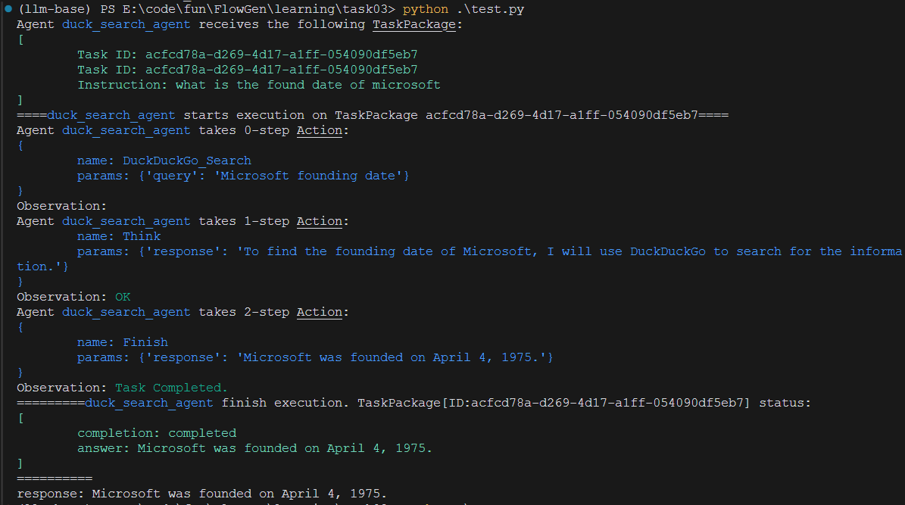
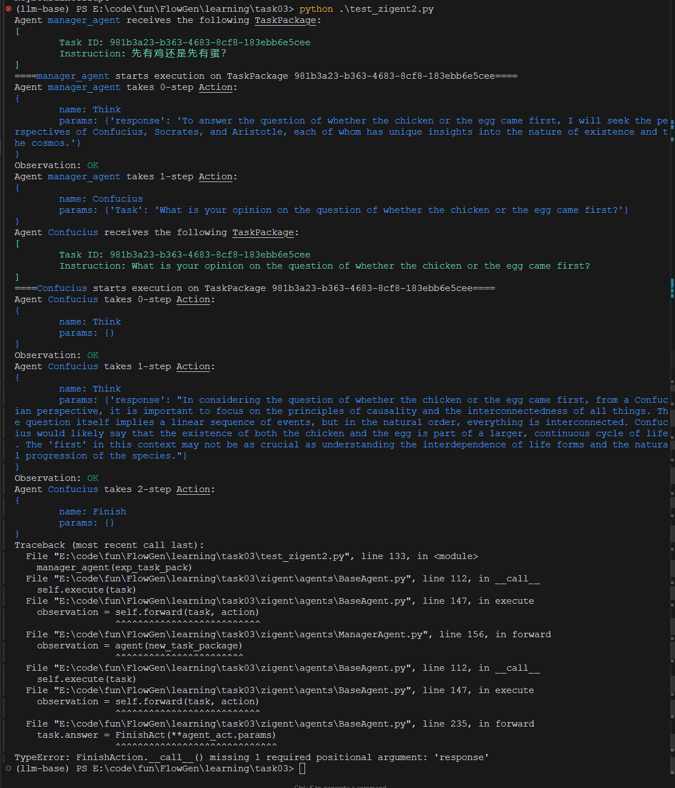
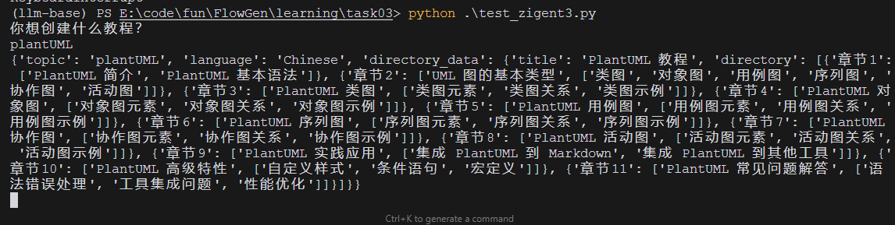
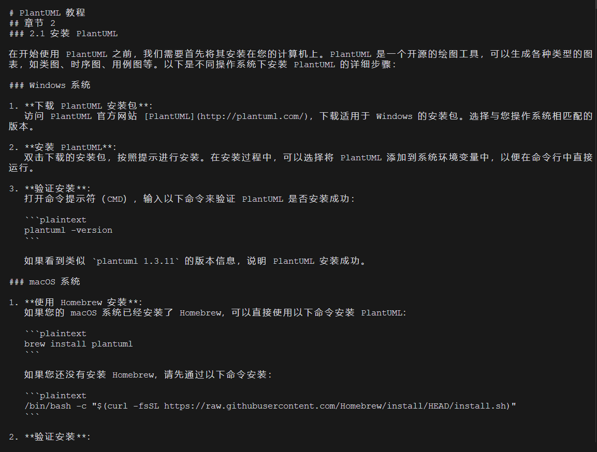

# 任务3

## 环境说明

1. zigent不太适合直接通过pip install 安装，发现里面依赖的wikipedia库的setup.py文件有问题，需要降级setuptools

pip install setuptools==65.5.1
pip install zigent

但是依旧存在问题，放弃pip install ，转向 拉取wow-agent仓库，复制里面到的zigent代码到同目录，然后运行test.py

git clone https://github.com/datawhalechina/wow-agent.git

2. 教程本身存在一定的问题。

如第一节的代码无声明agent_logger，导致运行时报错。

第三节的代码会提示llm_chain不存在。（当然，不排除是版本问题，更新了最新版本但是未及时更新文档。）

Traceback (most recent call last):
  File "E:\code\fun\FlowGen\learning\task03\test_zigent3.py", line 239, in <module>
    result = assistant(task)
             ^^^^^^^^^^^^^^^
  File "E:\code\fun\FlowGen\learning\task03\test_zigent3.py", line 161, in __call__
    directory_result = self.directory_action(
                       ^^^^^^^^^^^^^^^^^^^^^^
  File "E:\code\fun\FlowGen\learning\task03\test_zigent3.py", line 55, in __call__
    directory_data = llm.invoke({"prompt": directory_prompt})
                     ^^^^^^^^^^
AttributeError: 'LLM' object has no attribute 'invoke'

但是原本的zigent里面的方法也只有run，没有invoke...

## 运行效果

1. 搜索智能体（test_zigent.py）运行效果（效果尚未改名）

2. 哲学家多智能体（test_zigent2.py）运行效果，但是收尾有点问题。（暂无细究）

3. 教程编写智能体运行效果，其实思路同metagpt的编写智能体，先写大纲，再对大纲章节遍历，逐个细化。且最后在当前目录输出教程文件。

但是没有流式输出。

当然，按照这种思路，其实最简单的就是更改提示词，就可以实现AI生成小说了。